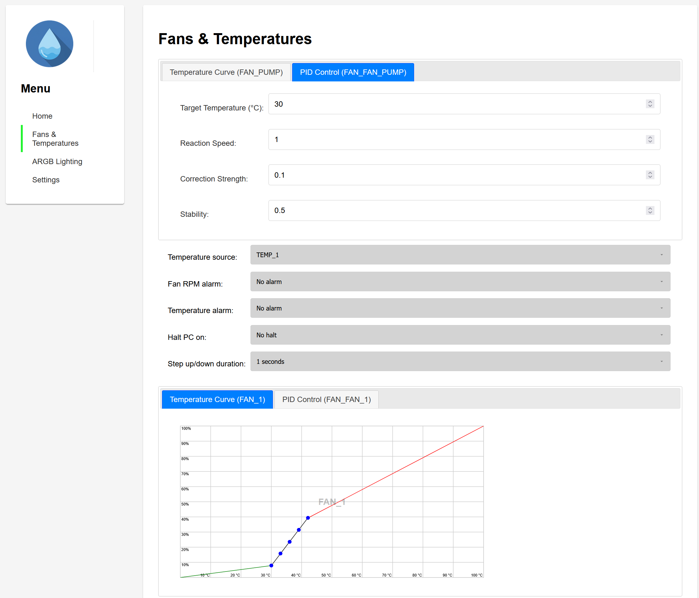
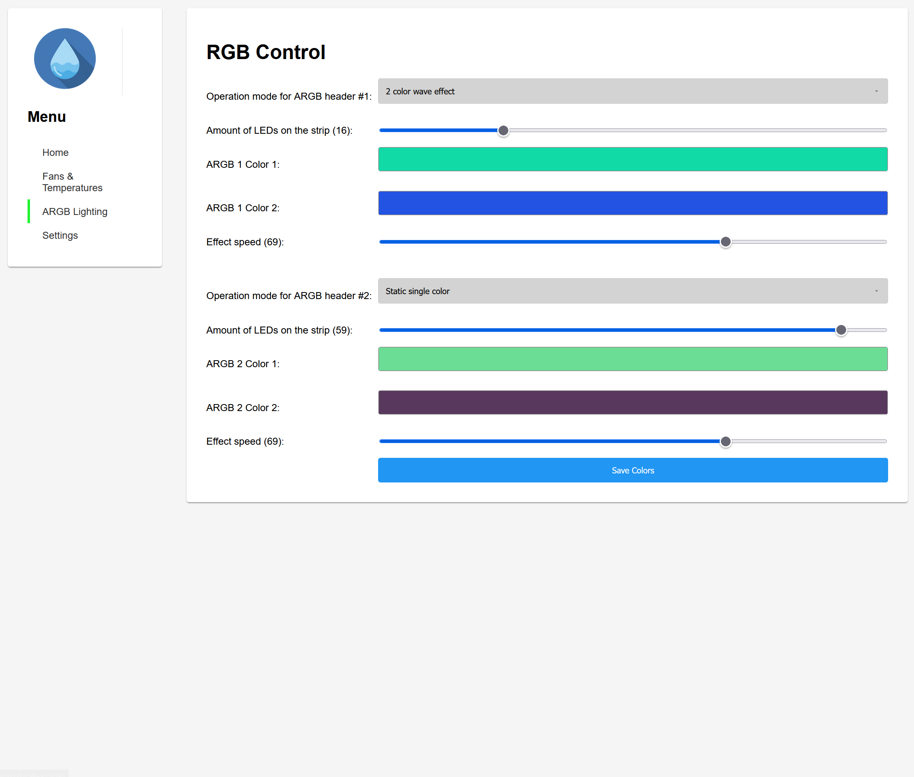
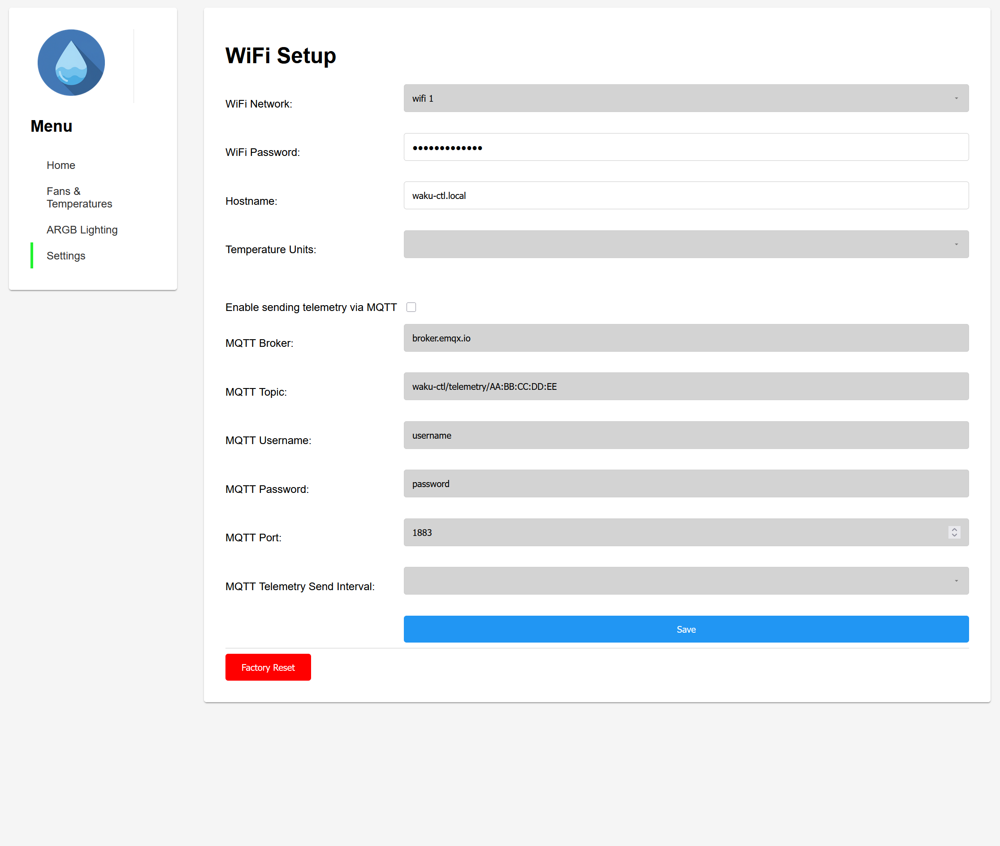
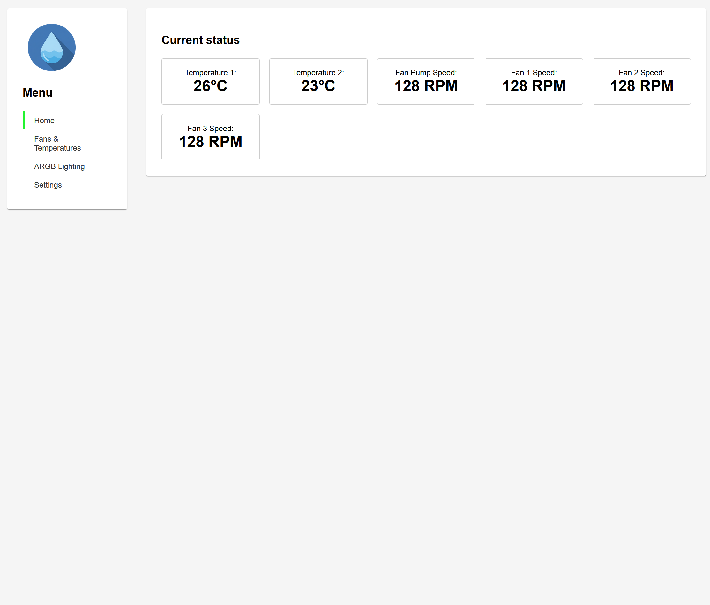

# waku-ctl - The open source water cooling controller.

waku-ctl is an open-source water cooling controller designed to give you ultimate command over your custom water loop, freeing you from the limitations of BIOS profiles and proprietary software.

This project contains the hardware and software for the Waku Control device.

## Support the Project

If you find waku-ctl useful, please consider supporting its development through my Kickstarter campaign. Your support will help grow the project and bring new features to life!

[**Support waku-ctl on Kickstarter!**](https://www.kickstarter.com/projects/nikolaidan/waku-ctl-the-open-source-water-cooling-controller/)

## Features

*   **Web Interface:** A user-friendly web interface for configuration and monitoring.
*   **Fan Control:**
    *   Control up to 4 fans/pumps.
    *   Customizable fan curves based on temperature readings.
    *   PID controller for precise temperature management.
    *   Set alarms for fan RPM and temperature thresholds.
    *   Configure step up/down duration for smooth fan speed transitions.
    *   Option to halt the PC on alarm conditions.
*   **Temperature Monitoring:**
    *   Supports two temperature sensors.
    *   Display temperatures in Celsius or Fahrenheit.
*   **ARGB Lighting Control:**
    *   Control two separate ARGB headers.
    *   Multiple lighting effects: Static, 2-color wave, 2-color moving, and rainbow.
    *   Pass-through mode from an external ARGB source.
    *   Adjust effect speed and the number of LEDs.
*   **Connectivity:**
    *   WiFi connectivity with support for offline (Access Point) mode.
    *   MQTT support for telemetry data.
    *   USB-CDC daemon for HWiNFO64 integration.
*   **On-device Display:**
    *   OLED screen to display system status, temperatures, fan speeds, and RGB modes.
*   **Hardware:**
    *   Open-source PCB and 3D printable case design.
    *   Based on the powerful ESP32-S3 microcontroller.

## Structure

*   `/pcb`: Contains the PCB design files from Altium.
*   `/case`: Contains the STL files for the 3D printable case.
*   `/src`: Contains the source code for the ESP32 firmware.
*   `/data`: Contains the web interface files.
*   `/usb-cdc-daemon`: Contains a small system tray daemon that reads data via USB and submits it to HWiNFO64.

The firmware is developed using Visual Studio Code with the PlatformIO extension.

## Building the Firmware

1.  Install [Visual Studio Code](https://code.visualstudio.com/).
2.  Install the [PlatformIO IDE extension](https://platformio.org/platformio-ide) from the Visual Studio Code marketplace.
3.  Clone this repository.
4.  Open the cloned repository folder in Visual Studio Code.
5.  PlatformIO will automatically detect the `platformio.ini` file and install the necessary dependencies.
6.  Click the "Build" button in the PlatformIO toolbar (the checkmark icon) to compile the firmware.
7.  Click the "Upload" button (the right arrow icon) to flash the firmware to your connected ESP32-S3 board.
8.  Click "Build Filesystem Image" and "Upload Filesystem Image"
9.  Reset the device and connect to its access point under the name of "waku-ctl" to finish setup.

## Building the USB CDC tray daemon for HWInfo64 integration

1.  Install [golang](https://go.dev/doc/install)
2.  Enter `usb-cdc-daemon` folder and run `go build .`
3.  Execute the binary and check HWInfo64, you should start getting telemetry

## Hardware

The hardware is based on an ESP32-S3 N16R8 development board or a board with a similar pinout.

### Main components

| Designator                                    | Quantity | Manufacturer                | Part Number   |
| --------------------------------------------- | -------- | --------------------------- | -------------------------- |
| Analog to Digital Converter                   | 1        | Texas Instruments           | ADS1115IDGSR               |
| Multiplexer                                   | 1        | Texas Instruments           | CD4053BPWR                 |
| 100nF Capacitors                              | 7        | Samsung Electro-Mechanics   | CL31B104KBCNNNC            |
| 8 channel Voltage Level Shiter                | 1        | Texas Instruments           | TXS0108EPWR                |
| 2 channel Voltage Level Shiter                | 1        | Texas Instruments           | TXS0102DCTT                |
| 10k Resistors                                 | 8        | UNI-ROYAL(Uniroyal Elec)    | 1206W4F1002T5E             |
| Schmitt Trigger                               | 1        | HTC Korea TAEJIN Tech       | 74HC14D                    |
| Reset Button                                  | 1        | Omron                       | B3FS-1000P                 |
| Passive Speaker/Buzzer                        | 1        | XHXDZ                       | HC9042-16                  |
| Phototransistor SMD-4P Transistor             | 1        | Sharp Microelectronics      | PC817X3CSP9F               |

### PCB layout

## UI

---

_This project is dedicated to my dad, Alexander Danylchyk who taught me a lot and inspired me to pursue an engineering carrer. You are dearly missed._

